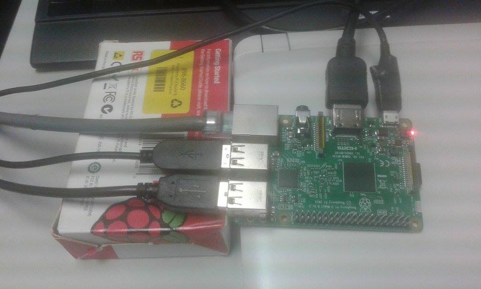
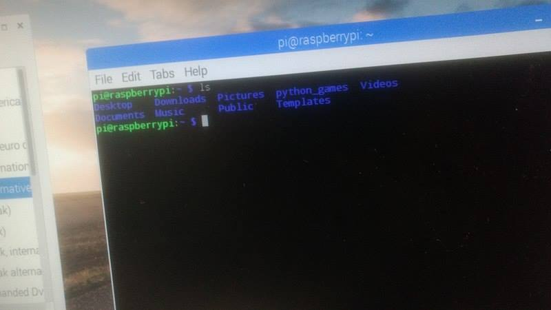
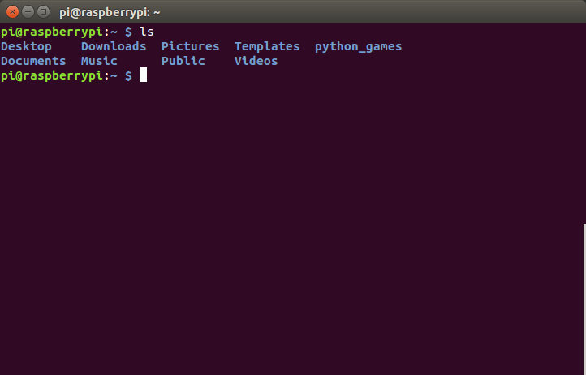
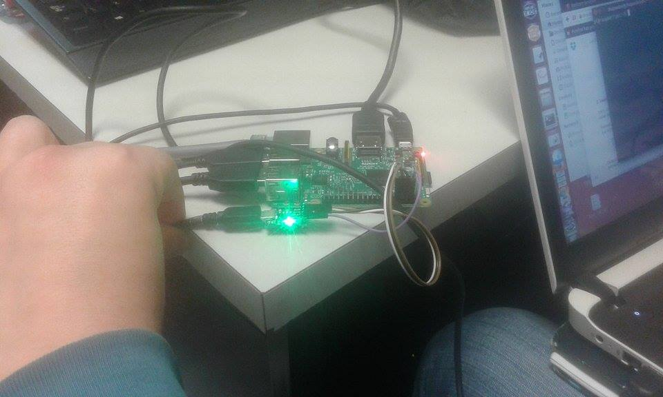
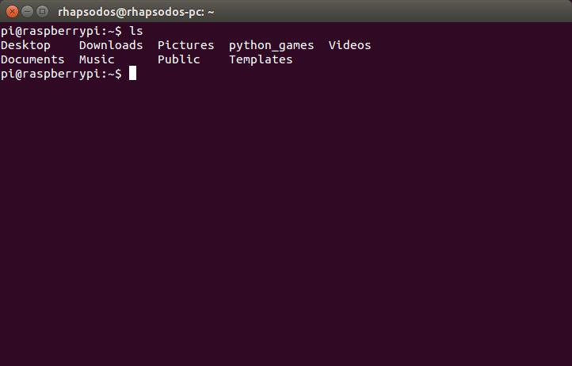

# Reporte practica 1
## Materia: Sistemas Embebidos
**Grupo:** 3CV1
Integrantes: 
- Hernández Martínez Luis Enrique
- Vazquez Guarneros Israel
- Venegas Meléndez Marcos
- Lopez Hernández Marcos Miguel (Se acaba de incorporar al grupo, le dio permiso de entregar esta practica con nosotros en lo que se le asigna uno)

En esta primera práctica se vieron las distintas formas de usar la raspberry pi, para esto previamente se debió de haber cargado el sistema operativo ( *raspbian jessie* ) en la memoria micro sd de la manera en la que se vio en clase.

### 1. Usar la raspberry pi 3 como computadora de escritorio
Despues de colacar la sd con el sistema operativo se debe colocar el cable hdmi al monitor, un teclado y un mouse por via usb y por ultimo la fuente de alimentacion, de tal manera que se vea de la siguiente forma:



Una vez cargado el sistema operativo se ve asi:



### 2. Usar la raspberry pi 3 mediante SSH
Primero se configura el SSH ya que este no se encuentra activo, despues se modifico el archivo *wpa_supplicant.conf* para agregar la red que se va a utilizar, esto tambien puede hacerse a travez de la interfaz grafica.
> wpa_supplicant.conf

```
        network={
                ssid="Tenda_06DEC0"
                psk="MqZe5RY4"
                key_mgmt=WPA-PSK
        }
```

Una vez que la conexion es establecida se obtiene la direccion de la raspberry con *ifconfig* y una vez que tanto la raspberry como la laptop se encuentran en la misma red se utiliza el siguiente comando:

```
        ssh pi@direccion
```

Se proporciona el usuario y contraseña de la raspberry y podremos usar la terminal de la raspberry a traves de la laptop:



### 3. Usar la raspberry pi 3 mediante consola
Para esta ultima parte de la practica es necesario habilitar el uart configurando el archivo config.txt que se encuentra dentro de la carpeta boot de la raspberry. Tambien hay que conectar el modulo ft232 en los pines correspondientes, una vez conectado se ve de la siguiente forma:



Y una vez conectado el modulo uart tecleamos esto en la laptop:


```
        $ screen /dev/ttyUSB0 115200
```

Donde /ttyUSB0 se refiere al modulo ft232 y 115200 se refiere al baudrate, una vez tecleado esto y con todo conectado correctamente le hacemos un reboot a la raspberry para poder usar la consola:

 

